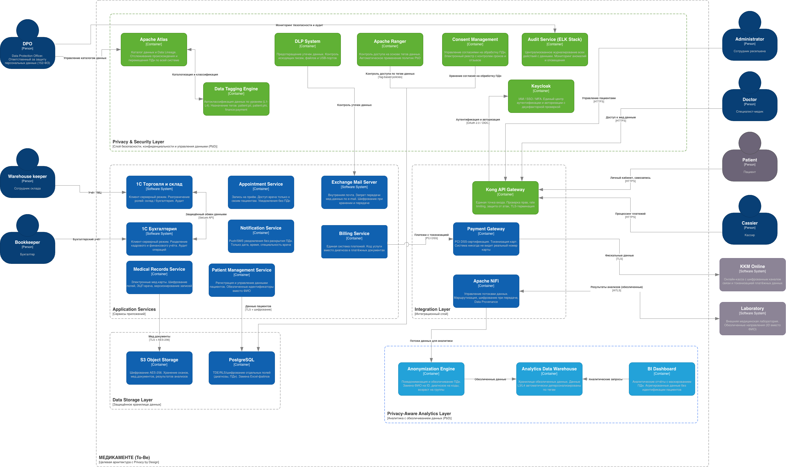

# Проектирование решения с Privacy by Design

## Диаграмма целевой архитектуры (To-Be)

### Что означают цвета на диаграмме

- **Зеленые блоки** - новые компоненты для безопасности и управления данными (Privacy by Design)
- **Голубые блоки** - сервисы приложений и инфраструктуры
- **Бирюзовые блоки** - аналитический слой, который работает только с обезличенными данными
- **Серые блоки** - внешние системы

---

## Анализ As-Is. Какие проблемы есть сейчас

В текущей архитектуре "Медикаменте" есть серьезные проблемы с защитой персональных данных:

1. **Данные не зашифрованы** - ФИО, диагнозы, сканы паспортов лежат в открытом виде в Excel-файлах на общем диске
2. **Доступ не разграничен** - любой сотрудник видит все данные: администратор может открыть зарплаты, складской работник - медкарты
3. **Действия не логируются** - нельзя узнать, кто и когда смотрел или менял данные
4. **Согласия не ведутся в электронном виде** - только бумажные формы, без учета сроков и отзывов
5. **Данные смешаны** - в платежном документе видны ФИО и услуга, а значит - фактически раскрывается диагноз
6. **Каналы передачи не защищены** - OLE-интеграция между 1С и ККМ работает без шифрования, ПДн пересылаются по электронной почте
7. **Нет защиты от утечек** - данные можно свободно скопировать на USB или отправить на внешнюю почту

---

## Новые блоки в архитектуре To-Be

### 1. Privacy & Security Layer (сквозной слой безопасности)

Этот слой проходит через всю архитектуру и отвечает за выполнение принципов PbD:

| Компонент                     | Что делает                                                                                                            |
| ----------------------------- | --------------------------------------------------------------------------------------------------------------------- |
| **Keycloak**                  | Единый вход (SSO) с двухфакторной аутентификацией - все пользователи проходят через одну точку                        |
| **Apache Ranger**             | Управляет доступом на основе тегов: например, данные с тегом patient:phi:L4 видит только лечащий врач в рабочее время |
| **DLP System**                | Блокирует утечки: не дает отправить письмо с ПДн наружу, контролирует USB-устройства                                  |
| **Consent Management**        | Ведет электронный реестр согласий на обработку ПДн - когда получены, на какой срок, были ли отозваны                  |
| **Audit Service (ELK Stack)** | Записывает все действия с данными в единый журнал и выявляет подозрительную активность                                |
| **Apache Atlas**              | Каталог данных: показывает, где хранятся ПДн и как они перемещаются между системами (Data Lineage)                    |
| **Data Tagging Engine**       | Автоматически присваивает данным уровни чувствительности L1–L4 (например, patient:pii:L3, patient:phi:L4)             |
| **Kong API Gateway**          | Единая точка входа для всех запросов: шифрует соединение (TLS), проверяет права, ограничивает частоту запросов        |

### 2. Integration Layer (слой интеграций)

| Компонент                     | Что делает                                                                                     |
| ----------------------------- | ---------------------------------------------------------------------------------------------- |
| **Kong API Gateway**          | Все внешние запросы - от пациентов, врачей, администраторов - идут через один защищенный шлюз  |
| **Apache NiFi**               | Перемещает данные между системами: шифрует на лету, маршрутизирует и отслеживает происхождение |
| **Payment Gateway (PCI DSS)** | Токенизирует банковские карты - система не видит и не хранит реальные номера карт              |

### 3. Data Storage Layer (вместо файлового хранилища)

| Компонент             | Что делает                                                                                                                                                     |
| --------------------- | -------------------------------------------------------------------------------------------------------------------------------------------------------------- |
| **PostgreSQL**        | Заменяет Excel-файлы. Поддерживает прозрачное шифрование (TDE), разграничение доступа на уровне строк (RLS), шифрование отдельных полей (диагнозы, назначения) |
| **S3 Object Storage** | Заменяет папки на общем диске. Хранит сканы паспортов, результаты анализов, медицинские документы - все зашифровано (AES-256)                                  |

### 4. Privacy-Aware Analytics Layer (аналитика без раскрытия ПДн)

Этот слой позволяет работать с аналитикой, **не раскрывая персональные данные**:

| Компонент                    | Что делает                                                                                          | Как защищает данные                                                                |
| ---------------------------- | --------------------------------------------------------------------------------------------------- | ---------------------------------------------------------------------------------- |
| **Anonymization Engine**     | Обезличивает ПДн перед отправкой в аналитику - заменяет или удаляет идентифицирующие поля           | ФИО → ID, диагнозы → коды МКБ, даты рождения → возрастные группы, адреса → регионы |
| **Analytics Data Warehouse** | Хранит **только обезличенные** данные. Все, что имело теги L3/L4, автоматически деперсонализируется | По аналитическим данным нельзя определить конкретного пациента                     |
| **BI Dashboard**             | Показывает отчеты на основе агрегированных и маскированных данных                                   | Бизнес видит нагрузку, статистику по услугам, финансы - но без доступа к ПДн       |

#### Как данные проходят через аналитический слой

1. Apache NiFi забирает данные из PostgreSQL и S3
2. Data Tagging Engine проверяет теги каждой записи
3. Записи с тегами L3/L4 проходят через **Anonymization Engine**, который:
   - заменяет ФИО на обезличенный хэш-идентификатор
   - заменяет точные даты рождения на возрастные группы (20–30, 30–40, ...)
   - заменяет текстовые диагнозы на коды МКБ-10
   - удаляет контактные данные (телефон, email, адрес)
   - агрегирует финансовые данные (суммы без привязки к конкретным пациентам)
4. После обезличивания данные попадают в Analytics DWH
5. BI Dashboard строит отчеты только по обезличенным и агрегированным данным

### 5. Новая роль: DPO (Data Protection Officer)

В архитектуру добавлен новый участник - **ответственный за защиту персональных данных**, как того требует 152-ФЗ. Что он делает:

- Следит за журналами безопасности через Audit Service (ELK Stack)
- Ведет каталог данных в Apache Atlas
- Проверяет, что политики обработки ПДн соблюдаются
- Реагирует на инциденты безопасности

---

## Как архитектура покрывает 7 принципов Privacy by Design

| Принцип PbD                            | Что сделано в To-Be архитектуре                                                                     |
| -------------------------------------- | --------------------------------------------------------------------------------------------------- |
| **1. Проактивный подход**              | Cистема выявляет и блокирует угрозы до того, как произойдет утечка (DPO/Audit Service)              |
| **2. Конфиденциальность по умолчанию** | По умолчанию доступ минимальный, данные шифруются без участия пользователя (Ranger/Tagging)         |
| **3. Конфиденциальность в дизайне**    | Защита встроена в саму архитектуру (Keycloak/Vault/PostgreSQL RLS/Kong)                             |
| **4. Полная функциональность**         | Analytics Layer - бизнес получает нужную аналитику, при этом конфиденциальность не страдает         |
| **5. End-to-end безопасность**         | Токенизация - данные защищены на каждом этапе жизненного цикла (TLS/mTLS,AES-256)                   |
| **6. Прозрачность**                    | Atlas (Data Lineage) + Audit + Consent Management - видно, где какие данные и что с ними происходит |
| **7. Уважение к пользователю**         | Личный кабинет пациента (Consent Management/Notification Service)                                   |
