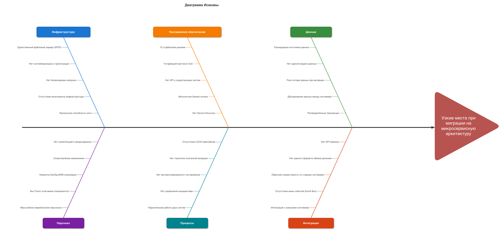

# Задание 4. Оценка узких мест при миграции

## Анализ текущей ситуации

### Текущее состояние системы (As-Is)

Компания "Медикаменте" использует локальную монолитную инфраструктуру:

- **Файловый сервер** (Windows Server 2022) - единственная точка хранения всех данных
- **Excel-файлы** на общем диске - журналы записей к врачам, реестры пациентов, реестры анализов
- **1С:Бухгалтерия** и **1С:Торговля и склад** - работают в файловом режиме, взаимодействуют через устаревший OLE-протокол
- **Exchange Mail Server** - корпоративная почта, используется в том числе для передачи конфиденциальных данных
- **ККМ** - контрольно-кассовая машина, подключена к 1С через OLE
- **Active Directory** - единственный механизм контроля доступа (доменная аутентификация)

Все операции с данными выполняются вручную. Шифрование, аудит действий и разграничение доступа к файлам отсутствуют. Данные хранятся в открытом виде, доступны всем сотрудникам.

### Цели миграции (To-Be)

Компания планирует переход на современную архитектуру со следующими компонентами:

| Текущий компонент      | Целевой компонент                        | Назначение                                              |
| ---------------------- | ---------------------------------------- | ------------------------------------------------------- |
| Excel-файлы            | **PostgreSQL** (TDE + pgcrypto + RLS)    | Надёжная БД с шифрованием и разграничением доступа      |
| Папки на общем диске   | **S3 Object Storage** (AES-256)          | Безопасное хранение файлов (сканы, результаты анализов) |
| Active Directory       | **Keycloak** (SSO + 2FA)                 | Единый центр аутентификации с двухфакторной проверкой   |
| Нет                    | **Kong API Gateway**                     | Единая точка входа, маршрутизация, Rate Limiting        |
| Ручная передача данных | **Apache NiFi**                          | Автоматизация потоков данных, шифрование при передаче   |
| Нет                    | **Apache Atlas / Ranger**                | Каталогизация данных и управление доступом по тегам     |
| Нет                    | **ELK Stack**                            | Централизованный аудит и мониторинг безопасности        |
| Нет                    | **HashiCorp Vault**                      | Управление ключами шифрования                           |
| ККМ через OLE          | **Платёжный шлюз (PCI DSS)**             | Токенизация банковских карт                             |
| Нет                    | **DLP-система**                          | Предотвращение утечек данных                            |
| Нет                    | **Anonymization Engine + Analytics DWH** | Обезличенная аналитика                                  |

### Ключевые процессы, затрагиваемые миграцией

| #   | Процесс                 | Что меняется                                                              |
| --- | ----------------------- | ------------------------------------------------------------------------- |
| 1   | Регистрация пациента    | Excel -> PostgreSQL, файлы -> S3, Active Directory -> Keycloak            |
| 2   | Запись на приём         | Excel-журналы -> PostgreSQL, ручная работа -> личный кабинет пациента     |
| 3   | Приём пациента врачом   | Excel/Word/файлы -> PostgreSQL с шифрованием полей + электронная подпись  |
| 4   | Лабораторные анализы    | Excel-реестры -> PostgreSQL, ручная передача -> автоинтеграция через NiFi |
| 5   | Приём оплаты            | Excel + 1С (OLE) -> единая платёжная система с токенизацией               |
| 6   | Бухгалтерский учёт      | 1С (файловый) -> 1С (клиент-серверный), OLE -> защищённый API             |
| 7   | Учёт ТМЦ                | 1С (файловый) -> 1С (клиент-серверный), OLE -> защищённый API             |
| 8   | Внутренние коммуникации | Exchange без защиты -> Exchange + DLP + шифрование S/MIME                 |

---

## Диаграмма Исикавы

Для выявления причин узких мест при миграции построена диаграмма Исикавы ("рыбья кость").

**Эффект:** "Узкие места при миграции на микросервисную архитектуру"

**6 категорий причин:**

1. **Инфраструктура** - серверы, сети, среда выполнения
2. **Программное обеспечение** - текущие системы и их ограничения
3. **Данные** - перенос, целостность и структура данных
4. **Персонал** - навыки, обучение, человеческий фактор
5. **Процессы** - разработка, развёртывание, эксплуатация
6. **Интеграция** - связь между компонентами и внешними системами

---

## Анализ категорий и выявленные проблемы

### Инфраструктура

Сейчас в компании один сервер Windows Server 2022. Он не рассчитан на работу множества сервисов (база данных, авторизация, мониторинг и др.), каждый из которых требует ресурсов и отказоустойчивости.

| Проблема                      | Описание                                                                      | Влияние                                                                                                       |
| ----------------------------- | ----------------------------------------------------------------------------- | ------------------------------------------------------------------------------------------------------------- |
| **Единственный сервер**       | Вся система зависит от одного сервера. При его отказе всё останавливается     | Один сервер не справится с нагрузкой новых сервисов, а его отказ приведёт к полной остановке                  |
| **Нет контейнеризации**       | Нет Docker и Kubernetes для изоляции и управления сервисами                   | Без контейнеров управление десятками сервисов потребует ручных операций с высоким риском ошибок               |
| **Нет балансировки нагрузки** | Нет распределения запросов между копиями сервисов                             | При росте числа пользователей единственная копия сервиса станет узким местом                                  |
| **Нет мониторинга**           | Невозможно отслеживать нагрузку на процессор, память, диск, сеть              | Проблемы будут обнаружены только когда пользователи начнут жаловаться                                         |
| **Слабая сеть**               | Сеть рассчитана на файловый доступ, а не на интенсивный обмен между сервисами | Микросервисы генерируют на порядок больше трафика: один запрос пользователя порождает 5-15 внутренних вызовов |

### Программное обеспечение

Текущее ПО не имеет программных интерфейсов и работает в устаревших режимах, что мешает интеграции с новой архитектурой.

| Проблема                         | Описание                                                                            | Влияние                                                                                                         |
| -------------------------------- | ----------------------------------------------------------------------------------- | --------------------------------------------------------------------------------------------------------------- |
| **1С в файловом режиме**         | 1С работает с файловой базой на общем диске без серверного контроля                 | Файловый режим не поддерживает одновременную работу нескольких пользователей - возникают блокировки и конфликты |
| **Устаревший протокол OLE**      | Обмен данными между 1С и кассой идёт через OLE - медленный, блокирующий протокол    | Один зависший вызов может заблокировать всю цепочку обработки                                                   |
| **Нет программных интерфейсов**  | Excel, 1С и почтовый сервер не имеют интерфейсов для автоматического взаимодействия | Потребуются промежуточные адаптеры, которые добавят задержки и станут дополнительными точками отказа            |
| **Разбросанная бизнес-логика**   | Логика размазана по Excel-формулам, макросам, конфигурациям 1С и ручным процедурам  | Извлечение логики в отдельные сервисы - трудоёмкий процесс с риском потери бизнес-правил                        |
| **Нет автообнаружения сервисов** | В микросервисной архитектуре сервисы должны автоматически находить друг друга       | Без этого каждое изменение адреса сервиса требует ручного обновления настроек всех зависимых компонентов        |

### Данные

Данные хранятся в разных форматах и системах. Их перенос - один из самых критичных аспектов миграции.

| Проблема                      | Описание                                                                                      | Влияние                                                                                                         |
| ----------------------------- | --------------------------------------------------------------------------------------------- | --------------------------------------------------------------------------------------------------------------- |
| **Разнородные источники**     | Данные разбросаны: Excel-файлы, базы 1С, JPG/PDF в папках пациентов                           | Для каждого формата нужен отдельный процесс переноса со своей валидацией                                        |
| **Нет единой модели данных**  | Одни и те же данные (ФИО, платежи) хранятся в разных форматах с разными именами полей         | Без единой модели невозможно обеспечить целостность при переносе                                                |
| **Риск потери данных**        | Большие объёмы в нестандартных форматах: папки по ФИО, Excel с формулами, сложные проводки 1С | Ошибки при переносе могут привести к потере данных и длительному простою                                        |
| **Дублирование данных**       | Платежи вводятся дважды (Excel и 1С), данные пациентов дублируются в нескольких местах        | При миграции дубликаты создадут конфликты и исказят аналитику                                                   |
| **Распределённые транзакции** | В микросервисах данные хранятся в разных базах, единой транзакции больше нет                  | Согласованность данных между сервисами увеличивает задержки и сложность, при сбое нужны компенсирующие действия |

### Персонал

Человеческий фактор - критически важный аспект миграции. Технологии бесполезны, если команда не готова с ними работать.

| Проблема                                 | Описание                                                                                 | Влияние                                                                              |
| ---------------------------------------- | ---------------------------------------------------------------------------------------- | ------------------------------------------------------------------------------------ |
| **Нет опыта с микросервисами**           | Команда привыкла к Excel и 1С, опыта работы с новыми технологиями нет                    | Ошибки настройки новых систем приведут к снижению производительности                 |
| **Сопротивление изменениям**             | Сотрудники привыкли к текущим процессам: ручной ввод, пересылка файлов по почте          | Попытки работать "по-старому" создадут параллельные потоки данных и рассинхронизацию |
| **Нехватка инженеров по инфраструктуре** | Для поддержки микросервисов нужны специалисты по контейнерам, мониторингу, автоматизации | Без таких специалистов обновления и устранение сбоев будут медленными                |
| **Зависимость от ключевых людей**        | Знания о процессах и бизнес-правилах могут быть сосредоточены у 1-2 человек              | Уход ключевого специалиста может парализовать миграцию                               |
| **Переобучение всех сотрудников**        | Врачи, администраторы, бухгалтеры должны освоить новый интерфейс и процессы              | В период обучения скорость работы временно снизится                                  |

### Процессы

Текущие процессы не включают практик, необходимых для работы с микросервисной архитектурой.

| Проблема                                      | Описание                                                                    | Влияние                                                                                           |
| --------------------------------------------- | --------------------------------------------------------------------------- | ------------------------------------------------------------------------------------------------- |
| **Нет автоматической сборки и развёртывания** | Нет автоматизированного процесса сборки, тестирования и публикации сервисов | Каждое обновление требует ручных операций с высоким риском ошибок и длительным простоем           |
| **Нет стратегии поэтапной миграции**          | Без чёткого плана высок соблазн заменить всё разом                          | Одномоментная замена максимизирует риски - если что-то пойдёт не так, откат крайне сложен         |
| **Нет автоматического тестирования**          | Бизнес-правила существуют в головах сотрудников и Excel-формулах            | Без тестов нельзя гарантировать, что новые сервисы корректно воспроизводят логику                 |
| **Нет управления инцидентами**                | Нет инструкций по устранению сбоев, дежурств, процедур эскалации            | В микросервисной среде сбои неизбежны - без регламента время восстановления будет непредсказуемым |
| **Параллельная работа двух систем**           | В переходный период старая и новая системы работают одновременно            | Синхронизация данных между ними создаёт нагрузку, расхождения приведут к ошибкам                  |

### Интеграция

При переходе к микросервисам вместо прямого доступа к файлам появляются программные вызовы между сервисами и очереди сообщений.

| Проблема                   | Описание                                                                    | Влияние                                                                                                                            |
| -------------------------- | --------------------------------------------------------------------------- | ---------------------------------------------------------------------------------------------------------------------------------- |
| **Нет единой точки входа** | Нет шлюза для маршрутизации запросов к нужному сервису                      | Каждый клиент должен знать адреса всех сервисов, невозможна централизованная балансировка и ограничение нагрузки                   |
| **Разные форматы данных**  | Excel, 1С, JPG/PDF - каждая система "говорит на своём языке"                | Конвертация форматов на лету создаёт нагрузку и увеличивает задержки                                                               |
| **Обратная совместимость** | Новые сервисы должны уметь работать со старыми системами (1С, Excel, касса) | Поддержка старых протоколов параллельно с новыми удваивает сложность и количество точек отказа                                     |
| **Нет очереди сообщений**  | Нет механизма асинхронного обмена между сервисами (типа Kafka)              | Все вызовы синхронные - сбой одного сервиса каскадно блокирует все зависимые                                                       |
| **Внешние системы**        | Лаборатория, налоговая, банк - у каждой свой протокол и требования          | Нужны адаптеры с повторными попытками и обработкой ошибок; недоступность внешней системы не должна блокировать внутренние процессы |

---

## Рекомендации по устранению узких мест

### Подготовить инфраструктуру до начала миграции

**Решает:** единственный сервер, отсутствие контейнеров, балансировки, мониторинга

**Что сделать:**

- Развернуть кластер серверов (минимум 3 для отказоустойчивости)
- Настроить контейнеризацию (Docker + Kubernetes) и балансировку нагрузки
- Развернуть мониторинг (Prometheus + Grafana) с оповещениями
- Обеспечить отказоустойчивость базы данных (PostgreSQL с репликой)
- При необходимости расширить сетевую инфраструктуру

### Мигрировать поэтапно (паттерн Strangler Fig)

**Решает:** отсутствие стратегии миграции, риск замены всего разом, параллельная работа систем

**Что сделать:**

Вместо одномоментной замены - переносить процессы по одному. Новый сервис работает параллельно со старым, трафик постепенно переключается на новую систему.

**Порядок миграции (от менее рискованного к более критичному):**

| Этап | Процесс                 | Обоснование                                                           |
| ---- | ----------------------- | --------------------------------------------------------------------- |
| 1    | Учёт товаров            | Наименьший риск: нет персональных данных, мало пользователей          |
| 2    | Бухгалтерский учёт      | Перевод 1С в серверный режим - необходим для дальнейших этапов        |
| 3    | Регистрация и запись    | Простая бизнес-логика, первый контакт пациента с системой             |
| 4    | Приём оплаты            | Внедрение платёжного шлюза, требует аудита безопасности платежей      |
| 5    | Лабораторные анализы    | Интеграция с внешней лабораторией, обезличивание направлений          |
| 6    | Приём врача             | Самые критичные медицинские данные, шифрование, электронная подпись   |
| 7    | Внутренние коммуникации | Защита почты, контроль утечек - затрагивает привычки всех сотрудников |

### Внедрить шлюз и очередь сообщений на раннем этапе

**Решает:** отсутствие единой точки входа, отсутствие асинхронного обмена, обратная совместимость

**Что сделать:**

- Развернуть **Kong** (шлюз запросов) - единая точка входа для всех сервисов
- Развернуть **Kafka** (очередь сообщений) для асинхронного обмена между сервисами
- Реализовать защитный слой: шлюз направляет запросы на новые сервисы или на адаптеры к старым
- Все новые сервисы с первого дня работают через шлюз и очередь - единообразный подход
- Настроить автоматическое отключение неработающих сервисов (паттерн "предохранитель")

### Создать единую модель данных и проанализировать качество

**Решает:** разнородные источники, отсутствие модели данных, дублирование, риск потери

**Что сделать:**

- Провести инвентаризацию: перечислить все Excel-файлы, базы 1С, папки с документами
- Проанализировать качество данных: найти дубликаты, пустые поля, несоответствия
- Разработать единую структуру данных для всех сервисов
- Создать процессы автоматического переноса данных из каждого источника (через NiFi)
- Провести тестовый перенос на копии данных и проверить результат
- Подготовить план отката к старой системе на случай ошибок
- Настроить автоматическую синхронизацию данных между старой и новой системами на переходный период

### Внедрить автоматическую сборку, тестирование и развёртывание

**Решает:** ручное развёртывание, отсутствие тестирования

**Что сделать:**

- Настроить автоматические конвейеры сборки и публикации для всех сервисов
- Покрыть критичную бизнес-логику тестами до начала миграции
- Внедрить контрактное тестирование между сервисами (проверка совместимости интерфейсов)
- Настроить нагрузочное тестирование для выявления узких мест до запуска
- Внедрить безопасное обновление: сначала запуск новой версии рядом со старой, затем переключение трафика

### Нанять и обучить специалистов

**Решает:** нехватка навыков, зависимость от ключевых людей, сопротивление изменениям

**Что сделать:**

- Нанять 1-2 инженеров по инфраструктуре до начала миграции
- Обучить разработчиков работе с новыми технологиями (Docker, Kubernetes, PostgreSQL)
- Привлечь внешних консультантов для аудита архитектуры
- Создать внутреннюю базу знаний (wiki) по новой системе
- Провести обучающие семинары для конечных пользователей (врачи, администраторы, бухгалтеры)
- Документировать текущие бизнес-правила: провести интервью с ключевыми специалистами

### Разработать план управления инцидентами

**Решает:** отсутствие регламента реагирования на сбои, непредсказуемое время восстановления

**Что сделать:**

- Создать инструкцию для каждого сервиса: типичные проблемы, диагностика, шаги восстановления
- Настроить график дежурств - кто отвечает за систему и когда
- Определить уровни эскалации: от автоматического перезапуска до привлечения архитектора
- Настроить автоматические оповещения при превышении пороговых значений (задержки, ошибки, диск)
- Провести учебные тревоги до запуска в рабочую среду
- Подготовить план отката для каждого этапа миграции

### Обеспечить обратную совместимость через адаптеры

**Решает:** обратная совместимость, интеграция с внешними системами, разные форматы обмена

**Что сделать:**

- Для каждой старой системы (1С, Excel, касса) создать сервис-переводчик, который преобразует вызовы между старым и новым форматом
- Адаптеры работают как отдельные сервисы с защитой от каскадных сбоев
- Для внешних систем (лаборатория, налоговая, банк) создать интеграционные шлюзы с повторными попытками при ошибках
- По мере миграции каждого процесса соответствующий адаптер постепенно выводится из эксплуатации
